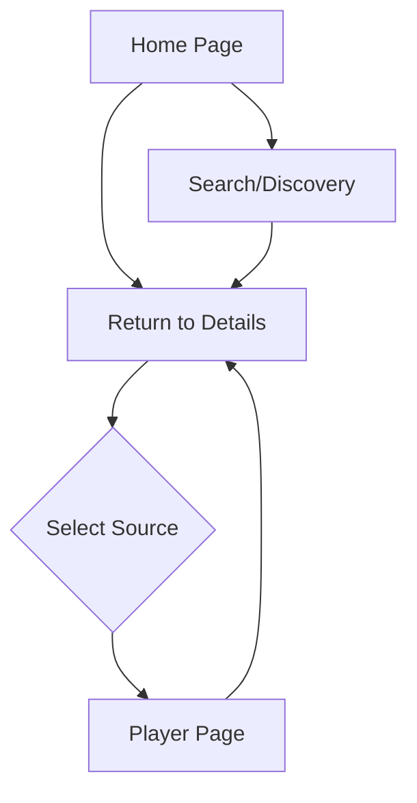

## 1. Product Overview
Flix is a modern, web-based movie and TV show streaming aggregator designed for a single user without the need for authentication. It emulates the functionality of platforms like Stremio and Cloudstream by consolidating high-quality streaming sources into a unified, visually immersive interface. The product aims to provide a frictionless entertainment experience with cutting-edge UI/UX, prioritizing ease of discovery and playback reliability.

## 2. Core Features

### 2.1 User Roles
| Role | Registration Method | Core Permissions |
|------|---------------------|------------------|
| Viewer | No registration required | Full access to browse, search, and play content. |

### 2.2 Feature Module
Our streaming platform requirements consist of the following main pages:
1.  **Home Page**: Trending content, popular movies/shows, and new releases feeds.
2.  **Discovery/Search Page**: Advanced search with filters and category browsing.
3.  **Details Page**: Rich metadata display (plot, cast, rating) and source selection.
4.  **Player Page**: Video playback interface with controls.

### 2.3 Page Details
| Page Name | Module Name | Feature description |
|-----------|-------------|---------------------|
| Home Page | Hero Section | Displays a featured movie or show with a high-quality backdrop, title, and "Watch Now" button. |
| Home Page | Content Rails | Horizontal scrollable lists showing "Trending Now", "Popular Movies", and "Top Rated TV" using TMDB data. |
| Discovery Page | Search Bar | Allows users to search by title, actor, or director with real-time suggestions. |
| Discovery Page | Filters | Filtering options for Genre, Year, Type (Movie/TV), and Sort Order (Popularity/Rating). |
| Details Page | Meta Info | Displays poster, synopsis, cast list, release year, runtime, and TMDB rating. |
| Details Page | Source Selector | Lists aggregated streaming sources with quality indicators (1080p, 720p, etc.) and server names. |
| Player Page | Video Player | Custom video player supporting play/pause, volume, seek, fullscreen, and quality selection. |

## 3. Core Process
The user flow focuses on immediate access to content without barriers like login or subscription walls.

## 4. User Interface Design
### 4.1 Design Style
-   **Color Palette**: Dark Theme. Background: Deep Grey/Black (#121212, #1E1E1E). Primary Accent: Red (#E50914). Text: White (#FFFFFF) and Light Grey (#B3B3B3).
-   **Typography**: Modern sans-serif fonts (e.g., Inter or Roboto) with clear hierarchy. Large headings for titles.
-   **Visuals**: High-quality backdrops, rounded corners (Card style), smooth micro-interactions.
-   **Animations**: Smooth page transitions (fade/slide), hover scaling on posters, skeleton loading states.

### 4.2 Page Design Overview
| Page Name | Module Name | UI Elements |
|-----------|-------------|-------------|
| Home Page | Hero & Rails | Full-width cinematic hero banner. Card-based horizontal sliders for content rails with hover expansion effects. |
| Details Page | Content Info | Split layout: Left side poster (sticky), Right side metadata and source list. Glassmorphism effects on overlays. |
| Player Page | Interface | Minimalist overlay controls that fade out when inactive. Red progress bar. |

### 4.3 Responsiveness
The platform is designed with a **Desktop-First** approach but must be fully responsive for tablet and mobile devices. It supports touch interactions for sliders and player controls.
