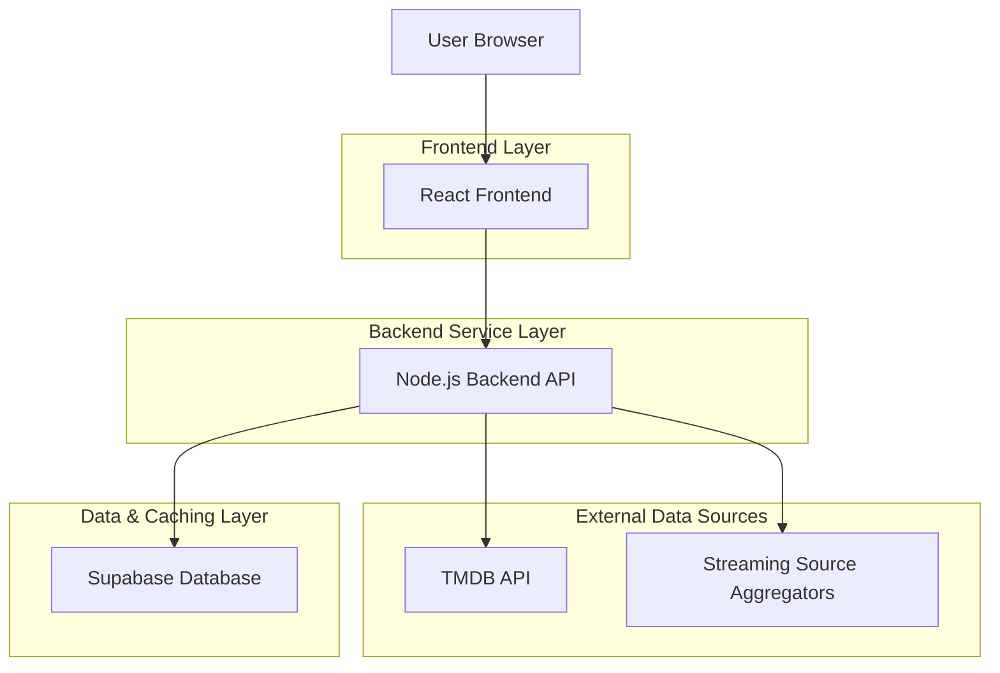
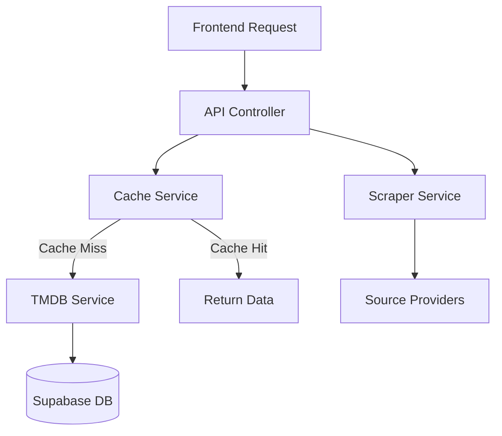
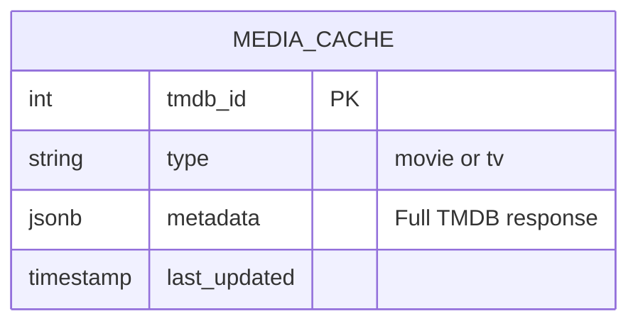

## 1. Architecture design



## 2. Technology Description
-   **Frontend**: React@18 + tailwindcss@3 + vite + framer-motion (for animations)
-   **Initialization Tool**: vite-init
-   **Backend**: Node.js (Express)
-   **Database**: Supabase (PostgreSQL) - Used primarily for caching TMDB responses and indexing source availability to reduce API latency.
-   **External APIs**:
    -   TMDB API (Metadata)
    -   Public Streaming Scrapers (Custom implementation to emulate Stremio/Cloudstream behavior)

## 3. Route definitions
| Route | Purpose |
|-------|---------|
| / | Home page, displaying trending and popular content rails. |
| /search | Discovery page for searching and filtering movies/TV shows. |
| /movie/:id | Movie details page with metadata and stream sources. |
| /tv/:id | TV Show details page, including season/episode selection. |
| /watch/:id | Video player page for streaming the selected content. |

## 4. API definitions

### 4.1 Core API

#### Get Content Metadata
```
GET /api/media/:type/:id
```
Fetches metadata for a movie or TV show. It first checks the Supabase cache; if missing, it fetches from TMDB, caches the result, and returns it.

**Response:**
| Param Name | Param Type | Description |
|------------|------------|-------------|
| id | number | TMDB ID |
| title | string | Content title |
| overview | string | Plot summary |
| poster_path| string | URL to poster image |
| backdrop_path| string | URL to backdrop image |

#### Get Streaming Sources
```
GET /api/sources/:type/:id
```
Triggers the scraping engine to find stream links for the specific content ID.

**Response:**
| Param Name | Param Type | Description |
|------------|------------|-------------|
| sources | array | List of available stream objects |

**Stream Object Structure:**
```json
{
  "quality": "1080p",
  "url": "https://example.com/stream.mp4",
  "source": "Provider Name"
}
```

## 5. Server architecture diagram


## 6. Data model

### 6.1 Data model definition
The database is used to cache metadata to reduce API calls to TMDB and improve performance.



### 6.2 Data Definition Language

```sql
-- create table for caching media metadata
CREATE TABLE media_cache (
    tmdb_id INTEGER NOT NULL,
    type VARCHAR(10) NOT NULL CHECK (type IN ('movie', 'tv')),
    metadata JSONB NOT NULL,
    last_updated TIMESTAMP WITH TIME ZONE DEFAULT NOW(),
    PRIMARY KEY (tmdb_id, type)
);

-- Index for faster lookups
CREATE INDEX idx_media_cache_updated ON media_cache(last_updated);
```
